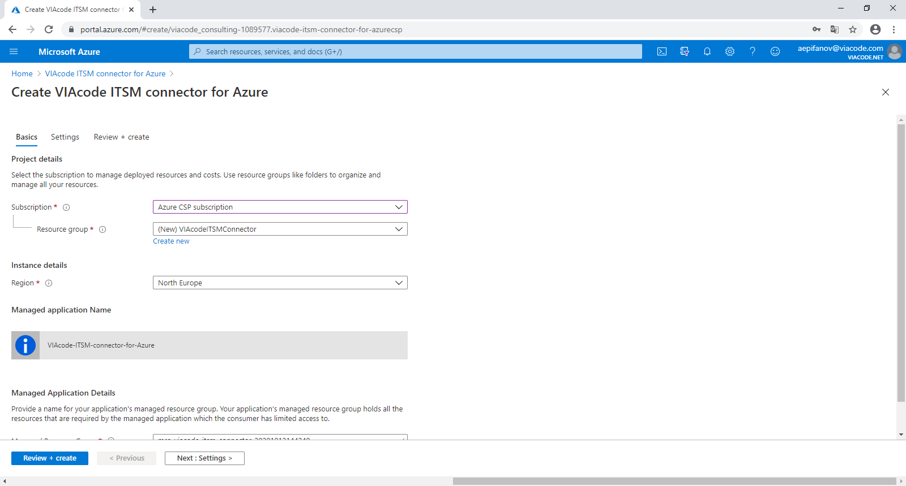
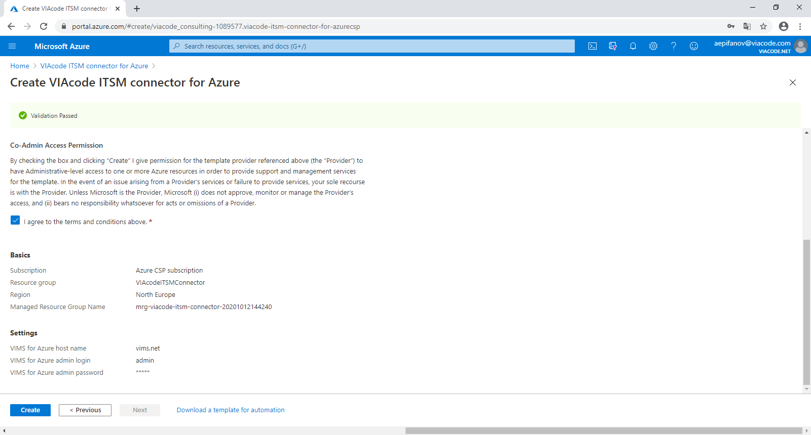
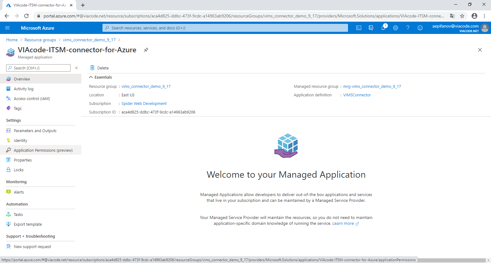
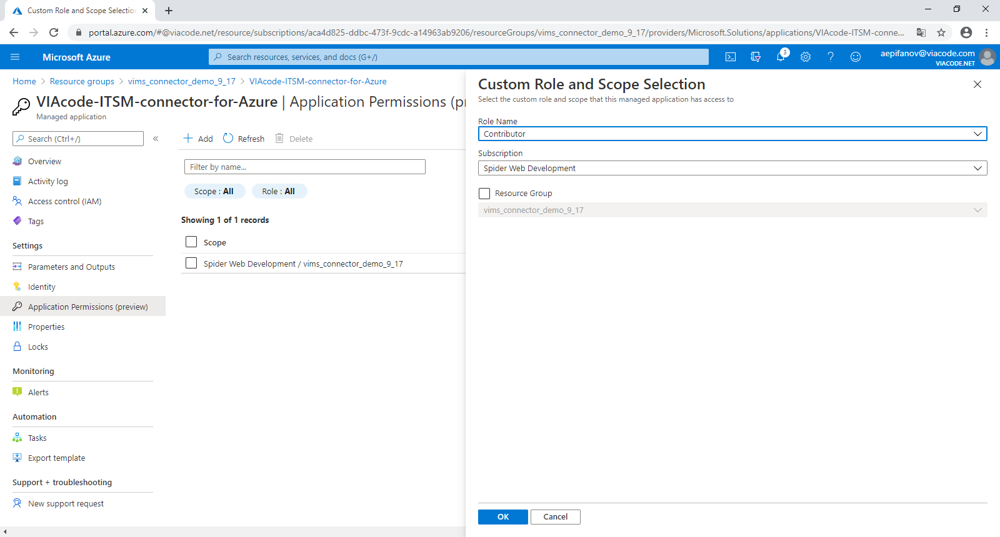
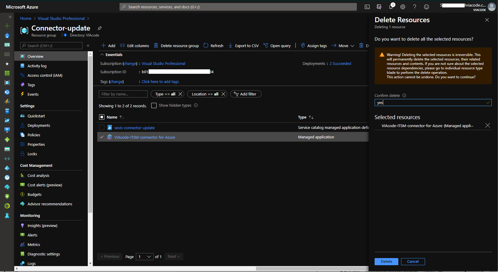

# VIAcode ITSM connector for Azure deployment and configuration guide
<!-- TOC -->
- [Before you begin](#before-you-begin)
  - [Deploy from Azure Marketplace](#deploy-from-azure-marketplace)
    - [Pricing](#pricing)

- [Configuration of VIAcode ITSM connector for Azure](#configuration-of-viacode-itsm-connector-for-azure)
  - [Basics](#basics)
  - [Settings](#settings)
  - [Review and create](#review-and-create)
  - [Alert state backward synchronization](#alert-state-backward-synchronization)
    - [Overview](#overview)
    - [How to setup](#how-to-setup)
- [Uninstallation of VIAcode ITSM connector for Azure](#uninstallation-of-viacode-itsm-connector-for-azure)
  - [Deletion Notes](#deletion-notes)
  - [Steps to Remove Application and Managed Resource Group](#steps-to-remove-application-and-managed-resource-group)  
  
- [Technical details](#technical-details)
  - [Supported alert types](#supported-alert-types)
<!-- TOC END -->
  
  This guide is based on version **1.0** of the ITSM connector for Azure. 

## Before you begin

Verify that your account user type is not Guest in the chosen tenant.

- Sign in to the [Azure Portal](https://portal.azure.com/).
- Select "Azure Active Directory", select "Users".

[Guest](https://docs.microsoft.com/azure/active-directory/b2b/user-properties) accounts have limited permissions. Deployment under a guest account will fail.

## Deploy from Azure Marketplace

- [Navigate](https://azuremarketplace.microsoft.com/en-us/marketplace/apps/viacode_consulting-1089577.viacode-itsm-connector-for-azure) to Microsoft Azure Marketplace and find "VIAcode ITSM connector for Azure" offer.

- Press "Get it now" button.
- Press "Continue".

You will be taken to Azure Portal to complete installation:

- Press "Create".

### Pricing

The total cost of running VIAcode ITSM connector for Azure is a combination of the selected software plan and cost of the Azure infrastructure on which you will be running it. The Azure infrastructure cost might vary with regards to the region, type of subscription and other discounts.

## Configuration of VIAcode ITSM connector for Azure

## Basics

- Choose a subscription to deploy the managed application.
- Create a new Resource Group.
- Select a region.
- Provide a name for your application's managed resource group.
- Press "Next : Settings >" button.

## Settings

You have to specify VIAcode Incident Management System hostname (FQDN) and administrator user credentials.
ITSM Connector will automatically create new VIMS user. All tickets are created on behalf of this user.
To create user we need to know Administrators credentials.

- Set VIAcode Incident Management System hostname.
- Set admin user login ("admin" by default).
- Set admin user password ("admin" by default).

## Review and create

- Agree to the terms and conditions.
- Press "Create" button.

## Alert state backward synchronization

### Overview

VIAcode ITSM connector for Azure provides an alert state backward synchronization mechanism. It enables automatic state synchronization of the VIMS incidents and Azure Alerts.

### How to setup

In order to configure alert state synchronization please provide VIAcode ITSM connector for Azure Managed App with Contributor Role for subscription VIAcode ITSM connector for Azure is deployed to in Azure Portal.

- Click on the installed managed application.
- Select 'Application Permissions (preview)' blade.

- Click "Add."

  - Select 'Contributor' role.
  - Check that Connector's subscription is selected.
  - "OK."

## Uninstallation of viacode ITSM connector for azure

### Deletion notes
Installation of VIAcode ITSM for Azure requires 2 resource groups:

- The First one for the application itself (Managed Application location).
- The Second is for the managed resources that the application requires (e.g. "mrg-viacode-itsm-z-<id>").

### Steps to Remove Application and Managed Resource Group
**Step 1:**
Go to Resource Group where the Managed Application installed (application named "VIAcode-ITSM-connector-for-Azure").

**Step 2:**
Select this Application and click "Delete" button, confirm the deletion by typing "Yes" on the sidebar, then click "Delete".
Deletion the Managed Application will consequently delete the second resource group and all of its content.

**Step 3:** (optional)
If the First Resource Group is empty - only Managed Application was stored there - you should also delete this Resource Group as well.

## Technical details

VIAcode ITSM connector for Azure supports all Azure recommendations and most alerts.
The following section explicates list of supported alerts.

### Supported alert types

VIAcode ITSM connector for Azure can process the following Azure alert types:

- Metric Alerts

  - Platform

- Log Alerts

  - Log Analytics
  - Application Insights

- Activity Log Alerts

  - Activity Log - Administrative
  - Activity Log - Policy
  - Activity Log - Autoscale
  - Activity Log - Security
  - Service Health
  - Resource Health
  
- Security Center Alerts

- Cost alerts: budget alerts
