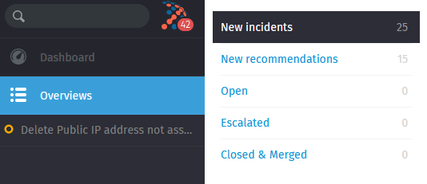
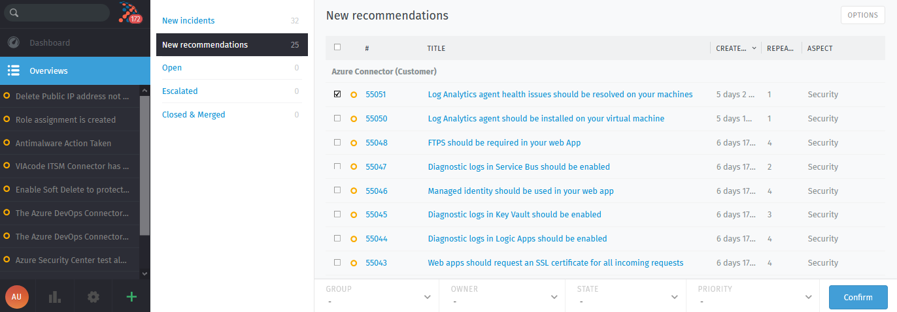
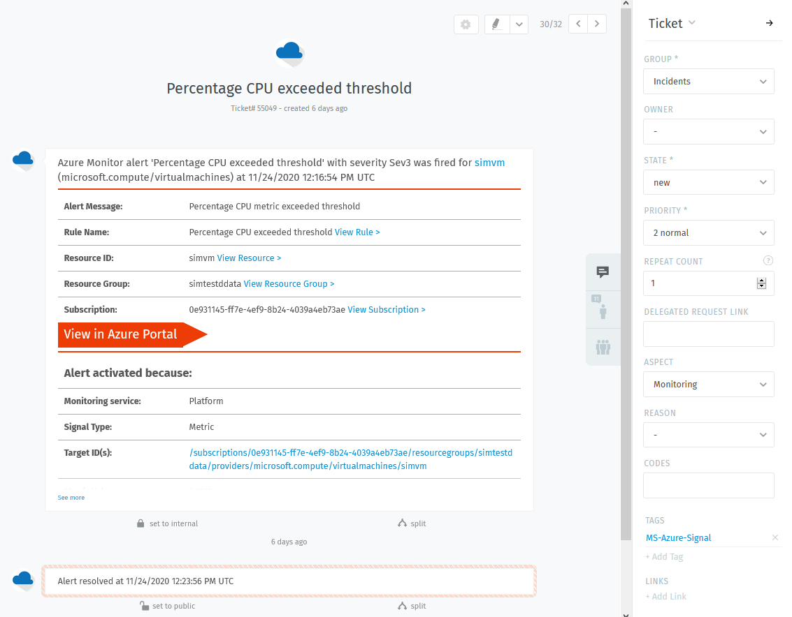
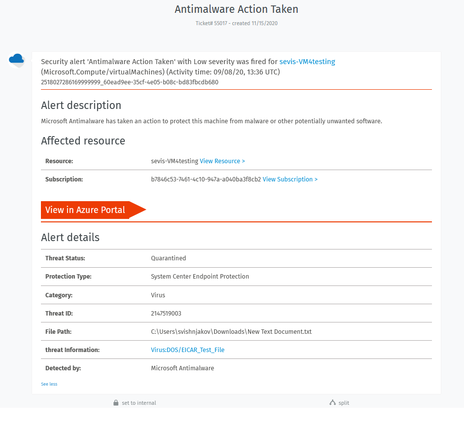

# VIAcode ITSM connector for Azure user guide

This guide is based on a version of VIAcode ITSM Connector for Azure **1.1**. 

<!-- TOC -->
- [Overview](#Overview)
- [VIMS](#VIMS)
	- [Groups of signals](#Groups of signals)
	- [New incidents group](#New incidents group)
	- [Managing different subscriptions](#Managing different subscriptions)
- [Azure Monitor Alerts](#Azure Monitor Alerts)
	- [Azure Monitor alert detection](#Azure Monitor alert detection)
- [Cost Management budget alerts](#Cost Management budget alerts)
	- [Budget alert detection](#Budget alert detection)
- [Azure Advisor recommendations](#Azure Advisor recommendations)
	- [Recommendation detection](#Recommendation detection)
- [Azure Security Center alerts](#Azure Security Center alerts)
	- [Secuirity alert detection](#Secuirity alert detection)
- [Features](#Features)
	- [Sync Azure signals](#Sync Azure signals)
	- [Backward synchronization](#Backward synchronization)
- [Known limitations](#Known limitations)
- [Links](#Links)
- [Contact us](#Contact us)
<!-- TOC END -->

[TOC]

## Overview

Thank you for choosing VIAcode ITSM connector for Azure. ITSM connector helps you keep under control different types of Azure signals in one single ITSM ticketing system. This document will help you start using the connector to monitor and track issues with your resources and services in Azure using ITSM ticketing system VIMS. 

Here you can see an overview table of all supported features in VIAcode ITSM connector for Azure. 

**Table 1** 

| Supported integrations                         | Backward synchronization | Detection time                                               | Prerequisite                   | Supported ITSM tool | Options                                                      |
| ---------------------------------------------- | ------------------------ | ------------------------------------------------------------ | ------------------------------ | ------------------- | ------------------------------------------------------------ |
| Azure Monitor Alerts and Service Health Alerts | yes                      | All signals created since connector installation             |                                | VIMS                |                                                              |
| Budget Alerts                                  | no                       | All alerts in subscription with "Active" state               |                                | VIMS                |                                                              |
| Security Center Alerts                         | yes                      | All active  Security Center Alerts created since connector installation | Azure Defender must be enabled | VIMS                | It is possible sync prior created active alerts using [Sync Azure signals]  option |
| Advisor Recommendations                        | no                       | All new and updated Recommendations created since connector installation |                                | VIMS                | It is possible sync prior created recommendations using [Sync Azure signals]  option |
## VIMS 

In order to manage different Azure notifications ITSM connector needs to be connected to IT service management system. VIAcode ITSM connector for Azure supports integration with ITSM ticketing system VIMS that stands for VIAcode Incident Management System.

### Groups of signals 

 ITSM ticketing system VIMS  simplifies engineering effort on managing Azure signals by collecting different Azure issues in one single place. 

By default, ticket on new active alerts (from Azure Monitor, Security Alerts, Budget Alerts)  will be created in "New incidents" group.   Notifications on active Azure Advisor recommendations appear in "New recommendations" group. 

### New incidents group

Active Azure alerts  can be seen in "New incidents" group under **Azure Connector(Customer)**  user. 

### New recommendations group

New Azure recommendations can be seen in "New recommendations" group under **Azure Connector(Customer)**  user. 

###  Managing different subscriptions

With one installation of  VIAcode ITSM connector for Azure it is possible monitor resources for one subscription in VIMS.  

In order to monitor several subscriptions with one ITSM tool you need to install connector to each subscription and specify FQDN of the same  ITSM ticketing system.

## Azure Monitor Alerts

### Introduction

Azure Monitor Alerts (Metric, Log Analytics, Activity log) will be automatically created in your ticketing system with detailed information about incidents since connector installation to the subscription.

VIAcode ITSM connector for Azure supports  [backward synchronization](#backward synchronization)  with  Azure Monitor alerts. 

### Azure Monitor alert detection

Once new alert appeared in Azure Monitor it will be automatically detected by the VIAcode ITSM connector for Azure, and a new ticket will be created in "New incidents" group for the ITSM tool VIMS.

Here you can see ticket for active Azure Monitor Metric Alert. Ticket contains alert name, link to affected resource and subscription id. Link `[View in Azure portal]` opens alert in Azure portal for an authenticated user. 

### Repeat Count

"Repeat count" setting for security alerts will indicate the number of alert repeats for the same resource. 

## Cost Management budget alerts
### Introduction

Budget alerts will be automatically created in your ticketing system with detailed information about incidents since connector installation to the subscription. 

### Budget alert detection

Once active alert appeared in Azure Cost Management it will be automatically detected by the ITSM connector, and a new ticket will be created in "New incidents" group for the ITSM tool VIMS. 

Currently supported scope for budget alerts by the VIAcode ITSM connector for Azure is **subscription**. 

On image below you can see ticket that has been generated for active budget alert. Ticket contains alert name, *current cost* detected when alert was triggered in Azure for the first time, link to affected resource, and subscription id. Link `[View in Azure portal]` opens alert in Azure portal for an authenticated user.  

### Repeat Count

"Repeat count" setting for budget alerts is not applicable. Each new alert created for an individually specified reached budget threshold that configured in Azure portal. 

## Azure Advisor recommendations
### Introduction

Azure Advisor is a personalized cloud consultant that helps you follow best practices to optimize your Azure deployments. The recommendations are divided into five categories: Reliability, Security, Performance, Operational Excellence, Cost. 

Azure Advisor recommendations will be automatically created in your ticketing system with detailed information about resources and recommended actions. By default, connector creates tickets in ITSM tool for new recommendations or recently updated recommendations - new affected resource detected (recommendations that have been  updated at a time after connector installation to the subscription).  

Prior created recommendations in Azure can be retrieved to ITSM system using [[Sync Azure signals](#Sync Azure signals)] button.  

### Recommendation detection

Once new recommendation appeared in Azure Advisor it will be automatically detected by the VIAcode  ITSM connector for Azure, and a new ticket will be created in "New recommendations" group for the ITSM tool VIMS.

On image below you can see ticket for active cost recommendation in Azure Advisor. Ticket contains recommendation name, link to affected resource and subscription id. Link `[View in Azure portal]` opens recommendation in Azure portal for an authenticated user. 

 

### Repeat count

Advisor recommendation can be applied to multiple resources.

For each new impacted resource number of the affected resources increasing  with "Repeat count"  setting updated by one. Each new impacted resource will appear in a new ***article*** for the existing recommendation with a link to it on Azure portal. 

## Azure Security Center alerts 
### Introduction

VIAcode ITSM connector for Azure supports Security Center threat protection capability. This means that any active threat protection alert in your Azure subscription will be detected and displayed as a ticket in the ITSM system.

VIAcode ITSM connector supports [backward synchronization](#backward synchronization) with Azure Monitor alerts. 

### Prerequisites

To get started with Security Center alerts notifications in your ITSM system [ **Azure Defender** ](https://docs.microsoft.com/en-us/azure/security-center/security-center-pricing#free-option-vs-azure-defender-enabled) feature  should be enabled in Azure.

### Security alert detection 

Each new created security alert in Azure portal will be automatically detected by the ITSM connector, and a new ticket will be created in "New incidents" group for the ITSM tool VIMS. 

On image below you can see ticket for active Security alert. Ticket contains alert name, link to affected resource, subscription id and  alert details.`[View in Azure portal]`  opens link to resource in Azure Portal for an authenticated user. 

### Repeat count 

"Repeat count" setting for security alerts will indicate the number of alert repeats for the same resource.

## Features

### Sync Azure signals

The [Sync Azure signals] button allows you obtain active **Security Alerts** and **Advisor recommendations** created in your subscription **prior** VIAcode ITSM connector for Azure installation.

To get prior incidents and recommendations in your ITSM tool perform the following steps: 

**Step1**

Go to Resource Group where the Managed Application installed (application named "VIAcode-ITSM-connector-for-Azure"). 

**Step2**

Open the  managed application named "VIAcode-ITSM-connector-for-Azure"

**Step3**

Click [Sync Azure signals] button 

**Step4**

Select types of signals to retrieve and click [Review+submit ] in Azure

### Backward synchronization

Backward synchronization capability in VIAcode ITSM Connector allows you to close Azure signals right from the ITSM system without necessity go to Azure portal. 

Backward synchronization option requires "Contributor" permissions to subscription. To check if your connector has Contributor permissions follow the [Connector configuration Guide](https://github.com/VIAcode/VIAcode-ITSM-connector-for-Azure/blob/main/VIAcode-ITSM-connector-for-Azure-deployment-and-configuration-guide.md#how-to-setup). 

To see integrations that support backward synchronization follow the [Overview](#Overview) table  in guide.

## Known limitations

### Issue: I am getting ITSM connector service alerts (E.g. Advisor recommendation created) from another connector in the same subscription

#### Resolution: 

Supported scenario is installation of one connector per subscription. Multiple connector installations per subscription is not supported. 

## Links

To gain better productivity and effectiveness working with Azure you can use additional services and tools that can be found by the following links.  

* [VIMS](https://azuremarketplace.microsoft.com/en-us/marketplace/apps/viacode_consulting-1089577.viacode-itsm-z) - VIAcode Incident Management System for Azure. Powerful system that creates a process around alerts, recommendations and threats in order to foster individual and organizational accountability.
* [VIAcode Azure DevOps](https://azuremarketplace.microsoft.com/en-us/marketplace/apps/viacode_consulting-1089577.vims-azuredevops)  - Azure DevOps connector for VIAcode IMS (VIMS).  The Azure DevOps Connector for VIAcode IMS integrates VIAcode Incident  Management System (VIMS) with Azure DevOps to enabling end-to-end SRE  escalation process for your Azure operations.

## Contact us

For more questions or feedbacks, please contact us:  [Contact VIAcode](https://www.viacode.com/contact-us/)

We opened a Github issue page in case you want to start a discussion or as an alternative way to report bugs/suggestions: https://github.com/VIAcode/VIAcode-ITSM-connector-for-Azure/issues

[TOC]

